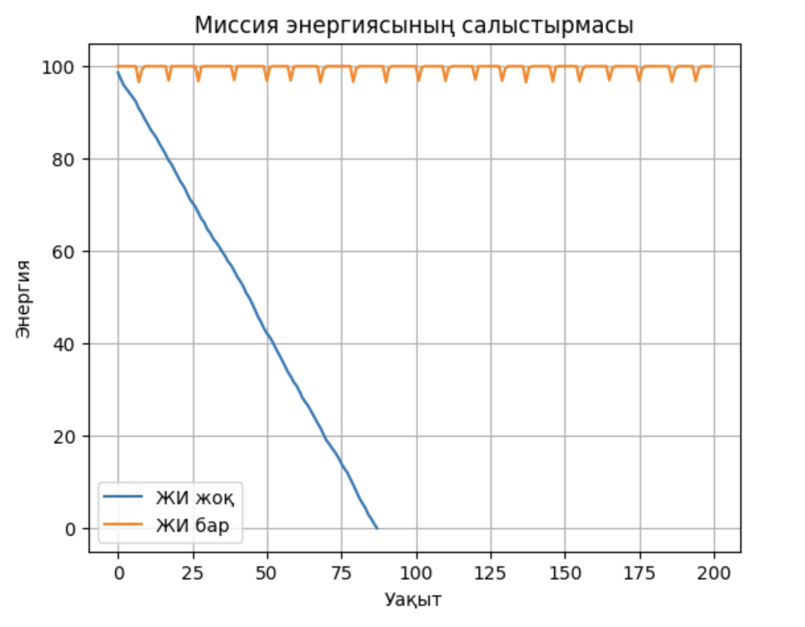

# Ғарыштық миссияны автономды қалпына келтірудің интеллектуалдық жүйесі
## Autonomous Mission Recovery System for Spacecraft

---

## Жобаның мақсаты

Бұл жобаның мақсаты – ғарыштық спутниктердің миссия барысында энергия, температура және жүйе күйінің деградациясына автономды түрде жауап бере алатын жасанды интеллект жүйесін әзірлеу.

---

## Мәселенің өзектілігі

Ғарыштық спутниктер адам қатысуынсыз ұзақ уақыт жұмыс істейді.  
Миссия барысында энергияның азаюы, температураның қауіпті деңгейге жетуі және ішкі жүйелердің істен шығуы спутниктің толық жоғалуына әкелуі мүмкін.

Қазіргі басқару жүйелері көбіне ақауды тек анықтайды, ал қалпына келтіру үшін жердегі оператордың араласуын талап етеді. Бұл кешігулер миссияның толық істен шығуына себеп болады.

---

## Ұсынылатын шешім

Бұл жобада жасанды интеллект негізінде жұмыс істейтін автономды миссияны қалпына келтіру жүйесі ұсынылады.  
Жүйе ақау жағдайында миссия параметрлерін өздігінен қайта жоспарлап, ресурстарды тиімді басқаруға мүмкіндік береді.

---

## Жасанды интеллект тәсілі

Жүйе Reinforcement Learning (Q-learning) логикасына негізделген.

Жасанды интеллект агенті келесі параметрлерді бақылайды:
- энергия деңгейі  
- температура  
- жүйенің жалпы күйі  

Осы мәліметтерге сүйене отырып, агент келесі әрекеттерді таңдайды:
- ештеңе істемеу  
- пайдалы жүктемені өшіру  
- салқындату жүйесін қосу  
- энергияны қайта бөлу  

---

## Марапат (Reward) функциясы

Жасанды интеллекттің әрекеттері арнайы марапат функциясы арқылы бағаланады.

- Тұрақты энергия деңгейі — оң марапат  
- Қауіпсіз температура диапазоны — оң марапат  
- Қауіпті жағдайлар мен деградация — айыппұл  

Бұл тәсіл агентті миссияны мүмкіндігінше ұзақ әрі тұрақты ұстауға үйретеді.

---

## Апробация

Жүйенің жұмысы симуляциялық ортада тексерілді.  
Жасанды интеллект қолданылған және қолданылмаған сценарийлер салыстырылды.

---

## Нәтижелер

Төмендегі график жасанды интеллект бар және жоқ жағдайдағы энергия динамикасын көрсетеді:

Эксперимент нәтижелері:
- ЖИ жоқ сценарийде энергия тез таусылады  
- ЖИ қолданылған жағдайда энергия тұрақтырақ сақталады  
- Температура қауіпсіз диапазонда ұсталады  

---

## Шектеулер

Бұл жоба жеңілдетілген симуляциялық модельге негізделген.  
Нақты спутник жүйелері үшін күрделі физикалық модельдер мен нақты телеметриялық деректер қажет.

---

## Болашақ даму

Алдағы уақытта:
- нақты спутник телеметриясымен интеграциялау  
- күрделі физикалық модельдер қосу  
- аппараттық деңгейде (hardware-in-the-loop) тестілеу  
жоспарлануда.

---

# Project Objective (English)

The objective of this project is to develop an artificial intelligence system capable of autonomously responding to energy degradation, thermal instability, and system health decline during a spacecraft mission.

---

## Problem Statement

Spacecraft operate autonomously for long periods in extreme environments.  
Energy depletion, temperature instability, and subsystem failures can lead to complete mission loss.

Most existing systems only detect failures and rely on ground control for recovery actions, introducing delays and additional risks.

---

## Proposed Solution

This project proposes an AI-based autonomous mission recovery system.  
The system dynamically reconfigures mission parameters without human intervention when critical degradation occurs.

---

## AI Approach

The system is based on Reinforcement Learning principles.

The AI agent observes:
- energy level  
- temperature  
- overall system health  

Based on this state, the agent selects actions such as:
- no action  
- payload shutdown  
- thermal control activation  
- energy redistribution  

---

## Reward Function

The agent’s decisions are evaluated using a reward function:
- stable energy levels → positive reward  
- safe temperature range → positive reward  
- critical states → penalty  

---

## Experimental Validation

The system was validated in a numerical simulation environment.  
AI-controlled and baseline scenarios were compared, and results were visualized using performance graphs.

---

## Results

Simulation results demonstrate that the AI-enabled system maintains mission stability longer and keeps critical parameters within safe ranges compared to a baseline system.

---

## Limitations

The current implementation uses a simplified simulation model.  
More accurate physical models are required for real spacecraft integration.

---

## Future Work

Future work includes:
- integration with real telemetry data  
- advanced physical modeling  
- hardware-in-the-loop testing  

---

## Команда / Team

**AIx-24**  
Жоба екі қатысушыдан тұратын командамен орындалды.
Beibit Marlen, Saulethanuly Darkhan Lyceum 24
